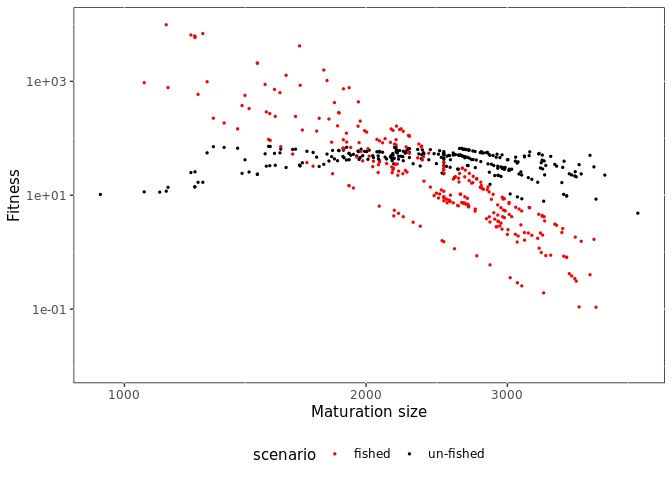

Introduction to mizerEvolution
================

## Overview

The mizerEvolution package is an extension of the mizer package (ref)
and simulate evolutionary processes within a size-structured model.
Below are described the X steps to use this package wich are described
more in details further down.

1.  [Installing mizerEvolution](#installing-mizerevolution).

2.  [Setting the model parameters](#setting-the-model-parameters).

3.  [Running a simulation](#running-a-simulation).

4.  [Exploring the results](#exploring-the-results).

## Installing mizerEvolution

mizerEvolution is an R package available on GitHub so you first need to
have R installed on your computer, need devtools package and then start
an R session and type:

``` r
devtools::install_github("baldrech/mizerEvolution")
```

After installing mizerEvolution, you need to load it via `library()`.

``` r
library(mizerEvolution)
```

mizerEvolution is compatible with R versions XX and later. The source
code for mizerEvolution is hosted on
[Github.](https://github.com/baldrech/mizerEvolution)

## Setting the model parameters

As with Mizer, you first need to creat an object of `class ?
MizerParams`. At the moment, the wrapper function `evoParams()` helps
you create this object. It is a tweaked version of `newTraitParams`
which add the necessary parameters to support species evolution,
therefore all the default parameters from Mizer are found back in this
function. `evoParams()` adds the `lineage` parameter which is used to
track the ancetry tree of species and the `RDD` parameter which is used
to set the recruitment function. It’s default is `extinctionRDD()` which
allow species to be removed from the ecosystem when they reach an
abundance below \(10^{-30}ind.m^{-3}\).

``` r
params <- evoParams(no_sp = 5 )
```

## Running a simulation

This is done by calling the `evoProject()` function (as in “project
forward in time”) with the model parameters. Similar to Mizer’s
`project()`, `evoProject()` takes the `mutation` parameter which is the
number of new species that are going to be introduced during the
simulation length. In the future this parameter will also be a rate of
new species appearing in the ecosystem.

``` r
sim <- evoProject(params = params, mutation = 1)
#> 2 mutants will be added
```

This produces an object of class `MizerSim` which contains the results
of the simulation.

## Exploring the results

After a simulation has been run, the results can be examined using a
range of `?plotting_functions`, `?summary_functions` and
`?indicator_functions`. The `plot()` function combines several of these
plots into one:

``` r
plot(sim)
```

<!-- -->

In this default Mizer plot, added phenotypes are considered as new
species.

<!-- Just as an example: we might be interested in how the proportion of large fish -->

<!-- varies over time. We can get the proportion of Herrings in terms of biomass that -->

<!-- have a weight above 50g in each of the 10 years: -->

<!-- ```{r} -->

<!-- getProportionOfLargeFish(sim,  -->

<!--                          #species = "Herring",  -->

<!--                          threshold_w = 50,  -->

<!--                          biomass_proportion = TRUE) -->

<!-- ``` -->

<!-- We can then use the full power of R to work with these results. -->

<!-- The functionality provided by mizer to explore the simulation results is more -->

<!-- fully described in  -->

<!-- [the section on exploring the simulation results.](exploring_the_simulation_results.html) -->

## Package functionalities

  - New species are copy of existing ones albeit with a change to one
    trait.

  - Each projections containing a new species is independent of the
    others. They are saved in a temporary folder before being binded at
    the end of the simulation

  - New plot functions allow to explore the evolutionary results

## Algorithm

Instead of projecting for the entire time one mizer class object, the
evoProject() will only project for a shorter amount of time, until a new
species needs to be added in the ecosystem. When adding a new species
(time chosen randomly), the projection stops, a new species is added
with `addSpecies()`. At the moment, to simulate mutations, the new
species is a copy of an existing one albeit for a slight difference in
one trait: the maturation size. Further update will include more than
one trait (any parameter in the model can become a trait) and mixed
reproduction as at the moment new species included this way reproduce
independtly from their “parent” and therefore make 2 diffent species.
Afte adding a new species, a new projection starts. It means that one
simulation is in reality a string of small projection. The `finalTouch`
function takes all theses projection and makes them into one MizerObject
wich is usable by any vanilla Mizer functions.

## Plotting evolutionary results

base Mizer functions cannot handle species being formed of different
“sub-species” so all plot functions have been updated to show species
or their “phenotypes” using the `lineage` parameter

Checking the biomass through time. The default plot has a colorblind of
10 colors and won’t work with more than 10 species, if you want to
personalise the plot, use `returnData = TRUE`.

<!-- -->

The following plots are not avaialble on this version yet but are
examples of what you can get with biomass data and trait evolution
through time.

The biomass per trait value of one species through time

<!-- -->

The trait value through time. It’s shown at the species level which is
the biomass weighted average of the species’ phenotypes

<!-- -->

Looking at the fitness of one species (total spawn output throughtout
lifetime) per trait value

<!-- -->

When two traits are involved

<!-- -->

Checking the average number of phenotypes per species through time.

<!-- -->

Add physio plots here

## Species invasion

Instead of generating phenotypic diverstity within existing species, the
model can instead introduce mutants in an existing ecosystem. One just
needs to give a data frame to the mutation argument instead of a
numeric.

``` r

params<- evoParams()

alien <- params@species_params[4:5,] # copy existing data frame
alien$h <- 50 # change some parameters
alien$alpha <- .6
alien$time <- c(50,75) # when are the invasive species coming in?
alien$lineage <- factor(99,levels = 99) # need to specify a lineage for these species otherwise they will be related to the endemic ones
alien$init_n_multiplier <- NULL # multiplier for the initial abundance

sim <- evoProject(params = params, mutation = alien)
#> 2 mutants will be added
plot(sim)
```

<!-- -->

New plot function have also been introduced to track the change in trait
value through time and to calculate the fitness of each species (here
being the total spawn output throughout lifetime of a cohort, averaged
per individual) to study the effect of the evolutionary processes on the
ecoystem

## Future updates

  - Fast initialisation
  - What else?
